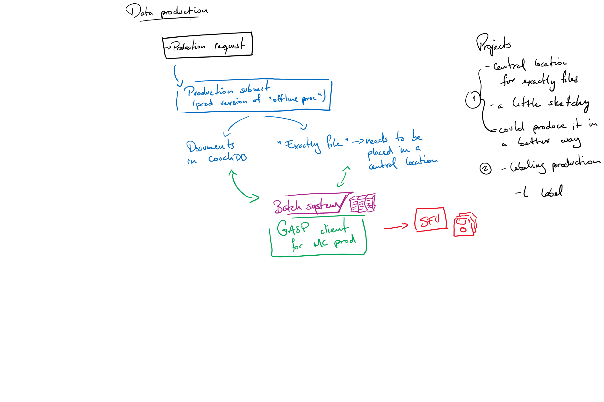

# **Production Overview**

This is a high-level overview of the steps that it takes to produce Monte Carlo simulation, starting from retrieval a production request, all the way to the final storage of it. An infographic is supplied at the bottom of the page (courtesy of Juan Pablo Yanez) that will hopefully help visualize this flow of data.

---

## **Monte Carlo Production**
1. Collaboration decides on important Monte Carlo dataset to generate (in the form of a **Production Request**)

2. The Production Request, available [here](https://snopl.us/production/production-request), will inform:
  * What **macros** (also known as **modules**) need to be run, which in turn decides the **event mode**
  * Whether it is **run-by-run** (pass in specific run information to recreate exact detector conditions) or **generic** (all the other modes; use default detector values)
  * How many events are simulated

3. Once the request is filled out and submitted, the emails listed in the contact portion and the **snoplus_vosupport** mailing list will receive the request which will have attached the created **jobs.json** file, containing all of the request details in the necessary format and ready to be submitted by `production_submit.py`

4. Ensure that there is a corresponding **production_module_x_x_x.py** for the RAT version being used; you can check in `data-flow/gasp/modules`. If there isn't, you can generate one by running `make_production` in `data-flow/gasp/bin`, which takes a path to the RAT version that you are generating the file for, the processing config file (ex. on cedar, this file is located at `data-flow/gasp/config/slurm_processing.cfg` - yes, the processing one is the correct one) and the output file name, which should follow the format above. Prior to running it, please source the data-flow `env.sh` and the `env_rat-x.x.x.sh` for the correct RAT from CVMFS - this will allow you to simply pass the RAT path environment variable `$RATROOT` as the path. An example of this process for RAT 6.18.7 would be:
```bash
cd ~/data-flow
source env.sh
source /cvmfs/snoplus.egi.eu/sl7/sw/6.18.7/env_rat-6.18.7.sh
cd gasp/bin
./make_production -c ../config/slurm_processing.cfg $RATROOT production_information_6_18_7.py
```
You should see it authenticate and login to CouchDB - this is because the result will be uploaded to couch as a document, which the Production Request page pulls sources its information from. On success, you then need to move the resulting file to the `modules` directory:
```bash
mv production_information_6_18_7.py ../modules
```
At this point, it is now available **ONLY ON THIS SITE**. Please commit it to Git so that it can then be pulled at each of our other sites. You may not have permission to commit on a site's data-flow repo, in which case please inform one of the current administrators (at this time that would be **Jamie Rajewski, jrajewsk@ualberta.ca** and **Richella Li, jl26@ualberta.ca**)

5. Update the **sites** files on **ALL** the sites that you will be running this production on. This can be done by looking in `data-flow/gasp/sites/` where you will see two files: a processing and a production one with the site name. If you edit one, you will see a massive structure of RAT versions - simply follow the same scheme to add the RAT version that you will be using to the appropriate file. The site files are **not** committed to Git as they are site-specific, so after adding it, you are done.

6. Submit this jobs file using `production_submit.py` with the appropriate arguments (consult the data-flow manual for that script for specific information)

7. When submitting production, an "**.exactly**" file is created which contains the module, run and pass number for each job in that production campaign
  * During the Production Request, there is a **Production Label** field; this is used to tag each job (and corresponding job doc) with that label, so that it is easy to find the data later on as part of that campaign. One can also use labels with `grabber.py` to download data by label, and also produce an .exactly file by using a label

8. Jobs will get submitted to a specific site, and the **enqueue_production** screen takes over to monitor
  * **enqueue_production** works very similarly to **enqueue_processing**
  * They **both** run `gasp_client.py`, where one looks at the **data-production** database on CouchDB, while the other looks at the **data-processing** database; the two databases are almost identical in that they utilize the same layout of views, but the content is naturally different

9. When a job's status is "completed", the output data will be saved on the specified Grid **storage element** (or **SE** for short; ex. lcg-snopse1 at SFU)

---


## **Visualization of the Production chain**





